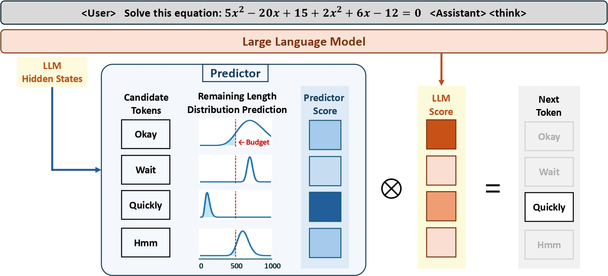

# Steering LLM Thinking with Budget Guidance

[[Demo](https://099185a3121ba1a856.gradio.live)] [[Paper](https://arxiv.org/pdf/2506.13752)] [[Hugging Face Models](https://huggingface.co/collections/senfu/budget-guidance-6844426427e777c8bc04a5ce)]




This repository contains the official code for **Budget Guidance**, a lightweight and non-invasive method for controlling the reasoning length of large language models (LLMs). It enables **budget-conditioned** generation without fine-tuning the LLM, and achieves strong performance across a wide range of reasoning benchmarks. 👉 **[Try our demo!](https://099185a3121ba1a856.gradio.live)** 🚀

## Table of Contents

- [News](#news)
- [Installation](#installation)
- [Quick Start](#quick-start)
- [Model Checkpoints](#model-checkpoints)
- [Training](#training)
  - [Data Augmentation](#data-augmentation)
  - [Train the Predictor](#train-the-predictor)
- [Evaluation](#evaluation)
- [Acknowledgement](#acknowledgement)
- [Citation](#citation)
- [License](#license)
- [Contributing](#contributing)


## News

* June 2025: Code and model checkpoints released.
* June 2025: Paper released on arXiv.


## Installation

```bash
# Create environment
conda create -n bg python=3.10
conda activate bg

# Install dependencies
pip install torch
pip install flash-attn --no-build-isolation

# Install modified transformers
cd 3rdparty/transformers && pip install -e .

# For training
cd training && pip install -e .
cd 3rdparty/trl && pip install -e .

# For evaluation
cd evaluation/lm-evaluation-harness && pip install -e .[math,vllm]
```


## Quick Start

Our method is seamlessly integrated into our modified version of the 🤗 Transformers library: simply specify the `token_budget` argument when calling `model.generate()`.


```python
import transformers
import torch
model = transformers.AutoModelForCausalLM.from_pretrained(
  "senfu/DeepSeek-R1-Distill-Qwen-7B-BG",
  torch_dtype=torch.bfloat16,
  attn_implementation="flash_attention_2",
)
tokenizer = transformers.AutoTokenizer.from_pretrained(
  "deepseek-ai/DeepSeek-R1-Distill-Qwen-7B",
)
prompt = "Jen enters a lottery by picking $4$ distinct numbers from $S=\\{1,2,3,\\cdots,9,10\\}.$ $4$ numbers are randomly chosen from $S.$ She wins a prize if at least two of her numbers were $2$ of the randomly chosen numbers, and wins the grand prize if all four of her numbers were the randomly chosen numbers. The probability of her winning the grand prize given that she won a prize is $\\tfrac{m}{n}$ where $m$ and $n$ are relatively prime positive integers. Find $m+n$."

messages = [
    {"role": "user", "content": prompt}
]
text = tokenizer.apply_chat_template(
    messages,
    tokenize=False,
    add_generation_prompt=True,
)
model_inputs = tokenizer([text], return_tensors="pt").to(model.device)

model.eval()
with torch.no_grad():
  # conduct text completion
  generated_ids = model.generate(
      **model_inputs,
      do_sample=False,
      max_new_tokens=32768,
      token_budget=500,  # add this to define a thinking token budget
  )
output_ids = generated_ids[0][len(model_inputs.input_ids[0]):].tolist()
print(tokenizer.decode(output_ids, skip_special_tokens=True))

```

## Model Checkpoints

The model checkpoints, including the trained predictor, are provided below.


| Model | Link |
|-------|------|
| DeepSeek-R1-Distill-Qwen-7B | [🤗 Hugging Face](https://huggingface.co/senfu/DeepSeek-R1-Distill-Qwen-7B-BG) |
| DeepSeek-R1-Distill-Qwen-32B | [🤗 Hugging Face](https://huggingface.co/senfu/DeepSeek-R1-Distill-Qwen-32B-BG) |
| Qwen3-8B | [🤗 Hugging Face](https://huggingface.co/senfu/Qwen3-8B-BG) |


## Training

### Data Augmentation

First, apply the data augmentation technique described in our paper:

```bash
cd training
python run_data_augmentation.py
```

### Train the Predictor
Then, start training:

```bash
bash train.sh
```


## Evaluation

We use [lm-evaluation-harness](https://github.com/EleutherAI/lm-evaluation-harness) as the evaluation framework.  
For evaluating reasoning quality under a thinking budget, we employ an external LLM (e.g., Azure OpenAI GPT-4o-mini) as the judge.

Example: to evaluate **DeepSeek-R1-Distill-Qwen-7B** on **MATH-500** with a thinking budget of 1000 tokens:

```bash
cd evaluation
export MODEL_PATH=senfu/DeepSeek-R1-Distill-Qwen-7B-BG
export TOKENIZER=deepseek-ai/DeepSeek-R1-Distill-Qwen-7B
export THINKING_BUDGET=1000

# Azure OpenAI API setup
export API_KEY_NAME=YOUR_AZURE_OPENAI_API
export API_ENDPOINT=YOUR_AZURE_API_ENDPOINT
export PROCESSOR=gpt-4o-mini

# Run evaluation
accelerate launch -m lm_eval \
    --model hf \
    --model_args pretrained=$MODEL_PATH,tokenizer=$TOKENIZER,dtype=bfloat16 \
    --seed 0 \
    --tasks openai_math \
    --batch_size 1 \
    --apply_chat_template \
    --output_path results \
    --log_samples \
    --gen_kwargs "max_gen_toks=32768,token_budget=$THINKING_BUDGET"
```


## Acknowledgement

We gratefully acknowledge the following open-source projects:

- [s1](https://github.com/simplescaling/s1): Evaluation codebase adaptation.
- [open-r1](https://github.com/huggingface/open-r1): Training codebase adaptation.


## Citation

If you find our work helpful, please consider citing:

```bibtex
@misc{li2025budgetguidance,
      title={Steering LLM Thinking with Budget Guidance}, 
      author={Junyan Li and Wenshuo Zhao and Yang Zhang and Chuang Gan},
      year={2025},
      eprint={2506.13752},
      archivePrefix={arXiv},
      primaryClass={cs.CL},
      url={https://arxiv.org/abs/2506.13752}, 
}
```

## License

This project is licensed under the MIT License. See [LICENSE](LICENSE) for details.


## Contributing

We welcome contributions to Budget Guidance!  
If you have suggestions, bug reports, or would like to contribute improvements, feel free to open an issue or submit a pull request.

